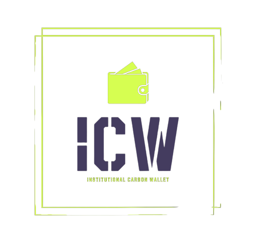

  

Institutional Wallet proof-of-concept for trading carbon credits. Built using the Safe Core SDK to make use of latest Account Abstraction features https://docs.safe.global/safe-core-aa-sdk/safe-apps.

- [Requirements](#requirements)
- [Getting started](#getting-started)
- [Built with](#built-with)
- [Features](#features)

# Requirements

- **MongoDB Instance**: This is required for user management.
- **Web3Auth Instance**: This is required for SSO, it also provides a keypair used throughout the application for signing transactions, fees, etc.

# Getting started

1. Run `yarn` from the project root to install the node modules.
2. Deploy a funded Safe by following the instructions in the `deploy-safe` directory README, found in [deploy-safe/README.md](deploy-safe/README.md).
3. Deploy the RBAC contracts found in the [contracts/](contracts/) directory and enable that module using the [deploy-safe/custom-module/enable-module](deploy-safe/custom-module/enable-module.ts) script.
4. Deploy your own MONGODB for user management https://www.mongodb.com/free-cloud-database. Then update your `.env` file.
5. Once you have a funded Safe change into the `apps/Wallet` directory and run `yarn` to install dependencies.
6. Create a `.env` file with the necessary data, check the example in [apps/Wallet/.env.example](apps/Wallet/.env.example).
7. Run `yarn dev` from `apps/Wallet`, app should run on `http://localhost:3000`

# Built with

- [Yarn](https://yarnpkg.com/) v4.0.0
- [NodeJS](https://nodejs.org/) v18.13.0
- [EthersJS](https://ethers.org/) v5.7.2
- [Safe-contracts](https://github.com/safe-global/safe-contracts/) v1.4.1

# Features

1. **Single Sign-On (SSO) EOA Authentication:**

   - Users can access an Externally Owned Account (EOA) on the Celo chain using corporate authentication, such as an email address.
   - Eliminates the need for users to manage private keys, as this step is handled transparently by our software in the background.

2. **EOA Abstracted Account Authentication:**

   - Users connecting their EOAs gain access to institutional abstracted accounts, facilitating transaction submissions.

3. **Add/Remove Users:**

   - Administrative functionality to add and remove delegated wallet users.
   - User accounts can be as simple as email addresses for SSO.

4. **Account Recovery:**
   - Implement account recovery features, allowing users to regain access to their wallets using a new password through the SSO provider.
